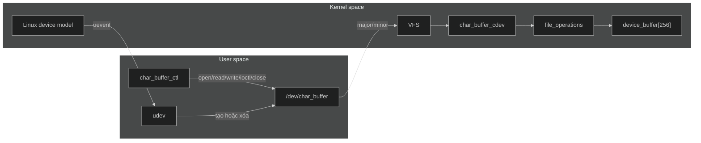
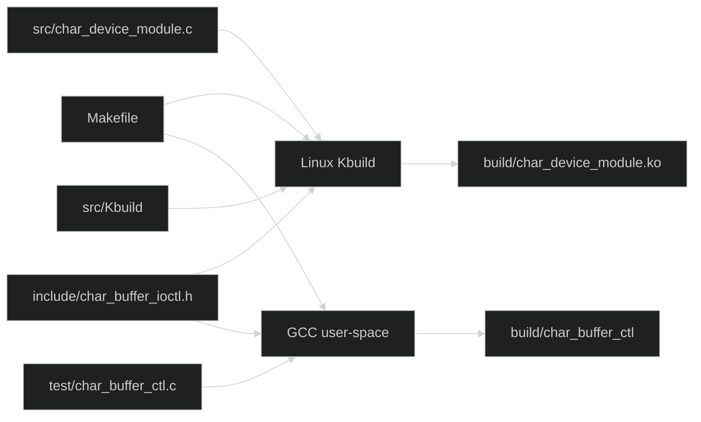
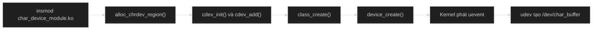
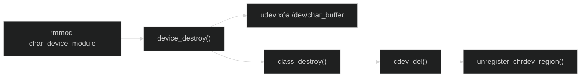

# Thực hành — Linux Character Device Buffer

`char_device_module.ko` là một external Linux kernel module triển khai character
device driver. Khi module hoạt động, chương trình user space truy cập driver qua
`/dev/char_buffer` bằng các system call `open()`, `read()`, `write()`, `ioctl()`
và `close()`.

Driver lưu dữ liệu trong một buffer kernel 256 byte, trong đó tối đa 255 byte
dùng cho nội dung. Mỗi lần ghi thay thế dữ liệu cũ. Ngoài đọc và ghi, driver có
hai lệnh ioctl để lấy kích thước hiện tại và xóa buffer.

## Device node và dữ liệu trong kernel



Device node và dữ liệu của driver là hai thành phần cần phân biệt:

| Thành phần | Khi module đã load | Sau khi module unload |
| --- | --- | --- |
| File `build/char_device_module.ko` | Vẫn nằm trên filesystem | Vẫn nằm trên filesystem |
| Module trong kernel | Trạng thái `Live` | Đã được gỡ khỏi kernel |
| `/dev/char_buffer` | Được udev tạo | Được udev xóa |
| `device_buffer` | Tồn tại trong kernel memory | Được giải phóng cùng module |

`/dev/char_buffer` không chứa nội dung đã ghi. Node chỉ mang loại device và cặp
major/minor để VFS tìm đúng `cdev`. Dữ liệu thật nằm trong `device_buffer` thuộc
kernel space. File `.ko` cũng không phải device node; nó là object được kernel
loader dùng để tạo module đang hoạt động.

## Cấu trúc

```text
practice/
├── include/
│   └── char_buffer_ioctl.h
├── src/
│   ├── Kbuild
│   └── char_device_module.c
├── test/
│   └── char_buffer_ctl.c
├── Makefile
├── README.md
└── build/                         # được tạo bởi make
    ├── char_device_module.ko
    └── char_buffer_ctl
```

- `src/char_device_module.c`: source của character device driver.
- `src/Kbuild`: yêu cầu Kbuild tạo `char_device_module.ko`.
- `include/char_buffer_ioctl.h`: giao diện ioctl dùng chung giữa kernel và user
  space.
- `test/char_buffer_ctl.c`: chương trình user space dùng để kiểm tra driver.
- `Makefile`: build, load, test và unload toàn bộ bài lab.
- `build/`: chứa module, chương trình test và file trung gian tự sinh.

## Quá trình build



Một lệnh `make` tạo hai kết quả. Kernel module được build bằng Kbuild tại
`/lib/modules/$(uname -r)/build`; công cụ test được GCC biên dịch như một chương
trình user-space thông thường. Header ioctl được dùng ở cả hai phía để command
number luôn giống nhau.

## Luồng load và unload module

### Khi nạp module



`alloc_chrdev_region()` yêu cầu kernel cấp một major/minor động. `cdev_init()`
nối object `cdev` với bảng `file_operations`; `cdev_add()` đăng ký quan hệ đó
với kernel. Sau cùng, `class_create()` và `device_create()` thêm device vào Linux
device model để udev tự tạo node.

Nếu một bước lỗi, hàm init hoàn tác các tài nguyên đã tạo trước đó rồi trả mã lỗi
âm. Module chỉ chuyển sang trạng thái `Live` khi toàn bộ quá trình thành công.

### Khi gỡ module



Cleanup chạy theo thứ tự ngược với init. Device bị hủy trước, sau đó class,
`cdev` và major/minor được trả lại. File `build/char_device_module.ko` không bị
xóa và có thể dùng để load module lần nữa.

## Mã nguồn

### Đăng ký file operations

```c
static const struct file_operations char_buffer_fops = {
    .owner = THIS_MODULE,
    .open = char_buffer_open,
    .write = char_buffer_write,
    .read = char_buffer_read,
    .release = char_buffer_release,
    .unlocked_ioctl = char_buffer_ioctl,
};
```

Bảng này ánh xạ system call của user space tới callback của driver:

| System call | Callback | Chức năng |
| --- | --- | --- |
| `open()` | `char_buffer_open()` | Cho phép mở device và ghi log |
| `write()` | `char_buffer_write()` | Sao chép dữ liệu vào kernel buffer |
| `read()` | `char_buffer_read()` | Sao chép dữ liệu về user space |
| `ioctl()` | `char_buffer_ioctl()` | Điều khiển hoặc truy vấn buffer |
| `close()` | `char_buffer_release()` | Xử lý khi reference cuối được đóng |

VFS thực hiện việc tạo và đóng `struct file`. Callback `open` và `release` chỉ
ghi log vì driver không cấp tài nguyên riêng cho từng file descriptor.

### Ghi vào buffer

```c
bytes_to_write = min(count, (size_t)(BUFFER_SIZE - 1));

if (copy_from_user(device_buffer, user_buffer, bytes_to_write))
    return -EFAULT;

device_buffer[bytes_to_write] = '\0';
data_size = bytes_to_write;
```

Kernel không truy cập trực tiếp pointer do user space cung cấp. Driver dùng
`copy_from_user()` và giới hạn dữ liệu ở 255 byte để dành byte cuối cho `\0`.
`data_size` lưu số byte hợp lệ; mỗi lần ghi thay thế nội dung trước đó.

Trong source thực tế, mutex được giữ trong suốt thao tác để process khác không
đọc hoặc thay đổi buffer cùng lúc.

### Đọc và EOF

```c
bytes_read = simple_read_from_buffer(user_buffer, count, offset,
                                     device_buffer, data_size);
```

Helper sao chép dữ liệu về user space và cập nhật file offset. Khi offset đã tới
`data_size`, lần đọc tiếp theo trả `0`, tức EOF. Nhờ đó chương trình đọc biết khi
nào phải dừng.

### Ioctl

Header dùng chung định nghĩa:

```c
#define CHAR_BUFFER_IOC_MAGIC 'c'
#define CHAR_BUFFER_CLEAR _IO(CHAR_BUFFER_IOC_MAGIC, 1)
#define CHAR_BUFFER_GET_SIZE _IOR(CHAR_BUFFER_IOC_MAGIC, 2, unsigned int)
```

| Command | Ý nghĩa |
| --- | --- |
| `CHAR_BUFFER_CLEAR` | Xóa buffer và đặt `data_size` về 0 |
| `CHAR_BUFFER_GET_SIZE` | Dùng `copy_to_user()` trả kích thước hiện tại |

`_IO` biểu diễn command không có payload. `_IOR` biểu diễn dữ liệu đi từ kernel
về user space. Nội dung buffer vẫn được truyền bằng `read()` và `write()`; ioctl
chỉ dành cho điều khiển và truy vấn trạng thái.

## Build

Yêu cầu GCC, GNU Make, udev và kernel headers khớp với kernel đang chạy:

```bash
test -d /lib/modules/$(uname -r)/build && echo "kernel headers: OK"
```

Build module và công cụ test:

```bash
make
```

Kiểm tra kết quả:

```bash
file build/char_device_module.ko
file build/char_buffer_ctl
modinfo build/char_device_module.ko
```

Có thể build riêng từng phần:

```bash
make module
make test
```

Hai cảnh báo sau không làm build thất bại:

```text
warning: the compiler differs from the one used to build the kernel
Skipping BTF generation ... due to unavailability of vmlinux
```

Nếu phiên bản GCC tương thích và file `.ko` vẫn được tạo thì có thể tiếp tục.

## Nạp và kiểm tra

```bash
make load
lsmod | grep '^char_device_module'
ls -l /dev/char_buffer
```

`make load` build, gỡ phiên bản cũ nếu có, load module mới và chờ udev xử lý.
Không cần lấy major từ `/proc/devices` hoặc gọi `mknod` thủ công.

Kết quả thực tế trong lần kiểm thử:

```text
char_device_module     12288  0
crw------- 1 root root 511, 0 ... /dev/char_buffer
```

Major `511` được cấp động và có thể khác trên hệ thống khác. `crw-------` cho
biết node là character device chỉ root được đọc và ghi.

## Kiểm tra read, write và ioctl

Ghi dữ liệu:

```bash
sudo ./build/char_buffer_ctl write "hello kernel"
```

Đọc lại và lấy kích thước:

```bash
sudo ./build/char_buffer_ctl read
sudo ./build/char_buffer_ctl size
```

Xóa buffer rồi kiểm tra lại:

```bash
sudo ./build/char_buffer_ctl clear
sudo ./build/char_buffer_ctl size
sudo ./build/char_buffer_ctl read
```

Kết quả đã kiểm chứng:

```text
Wrote 12 bytes
hello kernel
Buffer size: 12 bytes
Buffer cleared successfully
Buffer size: 0 bytes
```

Lệnh `read` cuối không in nội dung vì buffer đã rỗng. Chạy toàn bộ chuỗi tự động:

```bash
make check
```

## Kiểm tra kernel log

```bash
sudo dmesg | grep char_device_module | tail -30
```

Các mốc quan trọng:

```text
char_device_module: allocated major=511 minor=0
char_device_module: Loaded
char_device_module: device opened, major=511 minor=0
char_device_module: wrote 12 bytes
char_device_module: device closed, major=511 minor=0
char_device_module: read 12 bytes
char_device_module: buffer cleared
char_device_module: read 0 bytes
```

Các cặp `device opened` và `device closed` cho thấy tool đã mở và đóng file
descriptor. `read 0 bytes` là EOF sau khi buffer bị xóa.

## Gỡ và kiểm tra

```bash
make unload
lsmod | grep '^char_device_module'
ls -l /dev/char_buffer
sudo dmesg | grep char_device_module | tail -10
```

Sau khi gỡ, `lsmod` không còn module, `/dev/char_buffer` báo `No such file or
directory` và kernel log có:

```text
char_device_module: Unloaded
```

## Dọn file build

```bash
make clean
```

Lệnh này xóa `build/` nhưng không tự unload module đang hoạt động. Dùng
`make unload` trước nếu muốn gỡ module khỏi kernel.

## Lỗi thường gặp

### `File exists`

Module đã được load. Dùng target có xử lý phiên bản cũ:

```bash
make load
```

### `open: No such file or directory`

Module chưa load hoặc udev chưa tạo device node:

```bash
make load
ls -l /dev/char_buffer
```

### `Permission denied`

Node hiện chỉ cho root truy cập. Chạy công cụ bằng `sudo`.

### `Inappropriate ioctl for device`

User tool mới đang gọi một phiên bản module cũ chưa hỗ trợ command. Build và
reload lại:

```bash
make
make load
```

### `Invalid module format`

File `.ko` không khớp với kernel đang chạy:

```bash
uname -r
modinfo -F vermagic build/char_device_module.ko
```

### Không đọc được kernel log

Một số hệ thống giới hạn quyền đọc `dmesg`:

```bash
sudo dmesg | grep char_device_module
sudo journalctl -k | grep char_device_module
```

## Tài liệu tham chiếu

- [Building External Modules — Linux kernel documentation](https://docs.kernel.org/kbuild/modules.html)
- [Driver Basics — Linux kernel documentation](https://docs.kernel.org/driver-api/basics.html)
- [The Linux device model — Linux kernel documentation](https://docs.kernel.org/driver-api/driver-model/overview.html)
- [`ioctl(2)` — Linux man-pages](https://man7.org/linux/man-pages/man2/ioctl.2.html)
