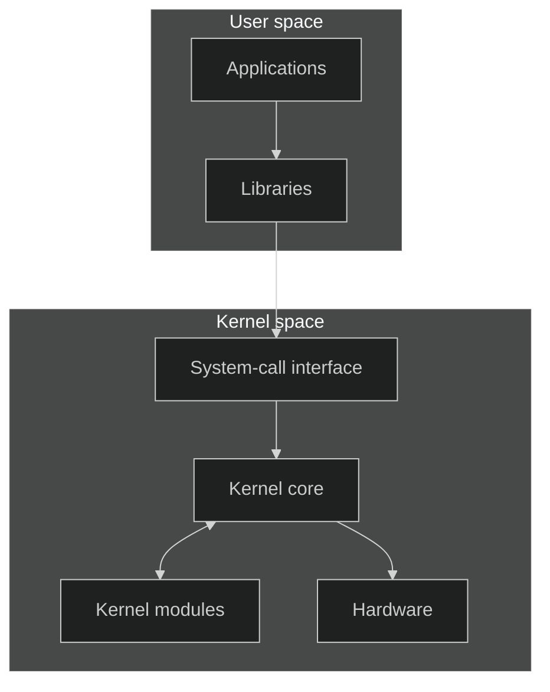
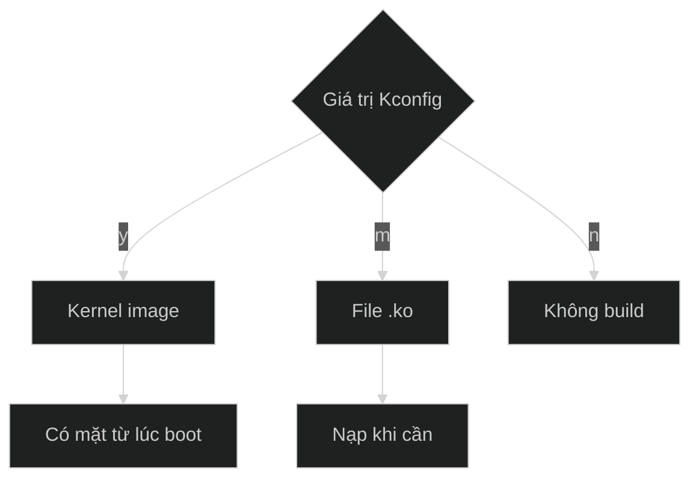
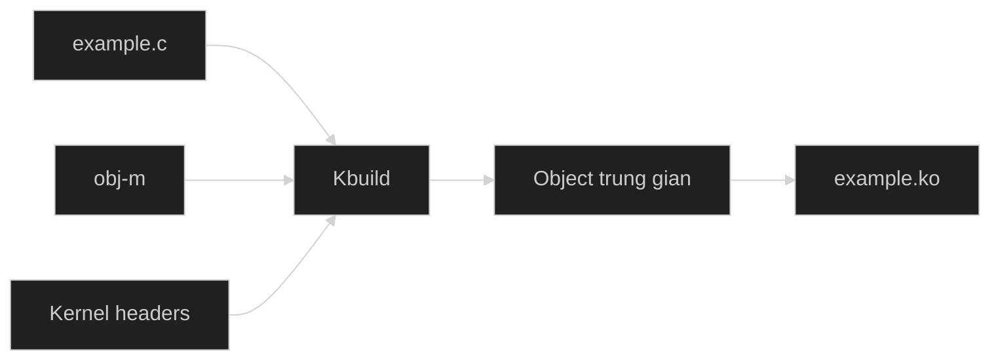
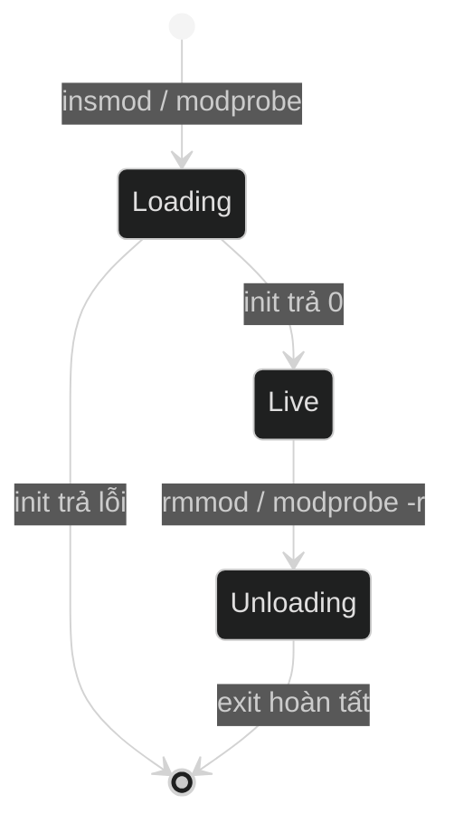
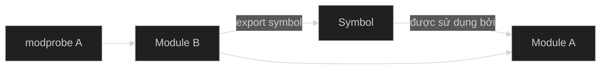
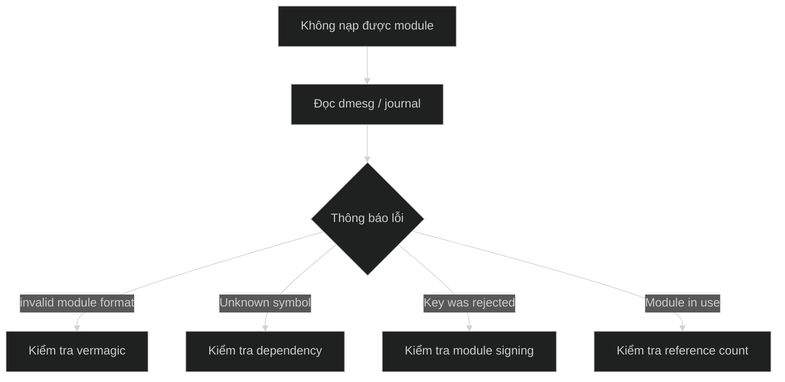

# Cơ sở lý thuyết về Linux Kernel Module

Tài liệu này giới thiệu Linux kernel module theo thứ tự từ khái niệm, viết mã,
build, vận hành đến xử lý lỗi. Các ví dụ sử dụng module giả `example` và có thể
đọc độc lập.

## Mục lục

1. [Khái niệm cơ bản](#1-khái-niệm-cơ-bản)
2. [Built-in và loadable module](#2-built-in-và-loadable-module)
3. [Cấu trúc source của module](#3-cấu-trúc-source-của-module)
4. [Build module bằng Kbuild](#4-build-module-bằng-kbuild)
5. [Vòng đời và quản lý tài nguyên](#5-vòng-đời-và-quản-lý-tài-nguyên)
6. [Metadata, parameter và kernel log](#6-metadata-parameter-và-kernel-log)
7. [Symbol, dependency và reference count](#7-symbol-dependency-và-reference-count)
8. [Tương thích và bảo mật](#8-tương-thích-và-bảo-mật)
9. [Gỡ lỗi module](#9-gỡ-lỗi-module)

## 1. Khái niệm cơ bản

### Kernel và hai không gian thực thi

Kernel là phần lõi của hệ điều hành. Nó quản lý CPU, memory, process, thiết bị
và cung cấp system call cho chương trình.

- **Kernel space** là vùng thực thi có đặc quyền cao dành cho kernel.
- **User space** là vùng chạy ứng dụng với quyền truy cập bị giới hạn.



### Kernel module

Kernel module là thành phần code mở rộng chức năng của kernel. Module thường
được dùng cho driver, filesystem, network protocol hoặc cơ chế quan sát hệ
thống.

Sau khi được nạp, module trở thành một phần của kernel. Nó không chạy như một
process độc lập và không có hàm `main()`.

> Code module chạy với quyền kernel. Một lỗi truy cập memory hoặc deadlock có
> thể ảnh hưởng đến toàn bộ hệ thống.

### Các thuật ngữ cần nhớ

| Thuật ngữ | Định nghĩa ngắn |
| --- | --- |
| Kernel image | File chứa kernel được nạp khi hệ thống boot |
| Kernel module | Thành phần code mở rộng kernel |
| LKM | Loadable Kernel Module, có thể nạp hoặc gỡ khi kernel chạy |
| External module | Module có source nằm ngoài kernel source tree |
| File `.ko` | Kernel object mà kernel loader có thể nạp |
| Kbuild | Hệ thống build chính thức của Linux kernel |
| Kernel headers | Khai báo và thông tin cần để build code cho một kernel |

External module mô tả **vị trí source và cách build**. Loadable module mô tả
**cách code được đưa vào kernel**. Một external module thường được build thành
file `.ko` rồi nạp như một LKM.

## 2. Built-in và loadable module

Một chức năng có thể được liên kết trực tiếp vào kernel hoặc build thành module
có thể nạp động.

| Đặc điểm | Built-in component | Loadable module |
| --- | --- | --- |
| Nơi chứa code | Kernel image | File `.ko` |
| Thời điểm sẵn sàng | Từ lúc boot | Sau khi được nạp |
| Có thể gỡ riêng | Không | Có, nếu không còn được sử dụng |
| Cập nhật | Thường phải build và reboot | Có thể build lại và reload |
| Phù hợp | Chức năng thiết yếu lúc boot | Chức năng tùy chọn hoặc cần thử nghiệm |

Trong Kconfig, lựa chọn thường có ba giá trị:

- `y`: build vào kernel image.
- `m`: build thành module `.ko`.
- `n`: không build.



Phần tiếp theo tập trung vào loadable module được build ngoài kernel source
tree.

## 3. Cấu trúc source của module

Module đăng ký một hàm khởi tạo và một hàm kết thúc:

```c
#include <linux/init.h>
#include <linux/module.h>

static int __init example_init(void)
{
    pr_info("example: loaded\n");
    return 0;
}

static void __exit example_exit(void)
{
    pr_info("example: unloaded\n");
}

module_init(example_init);
module_exit(example_exit);

MODULE_LICENSE("GPL");
```

Ý nghĩa từng thành phần:

| Thành phần | Ý nghĩa |
| --- | --- |
| `__init` | Đánh dấu code chỉ cần trong giai đoạn khởi tạo |
| `__exit` | Đánh dấu code chỉ cần khi module được gỡ |
| `module_init()` | Đăng ký hàm init |
| `module_exit()` | Đăng ký hàm exit |
| `MODULE_LICENSE()` | Khai báo license |

Hàm init trả `0` khi thành công hoặc errno âm khi thất bại. Hàm exit không trả
giá trị và phải thu hồi tài nguyên mà module đang sở hữu.

Đã có source, bước tiếp theo là biến nó thành file `.ko`.

## 4. Build module bằng Kbuild

External module phải được build bằng Kbuild và kernel headers của kernel đích.

Với source `example.c`, file Kbuild tối thiểu là:

```make
obj-m += example.o
```

Lệnh build:

```bash
make -C /lib/modules/$(uname -r)/build M=$PWD modules
```

| Thành phần | Ý nghĩa |
| --- | --- |
| `-C` | Chạy `make` trong cây build của kernel |
| `M=$PWD` | Chỉ thư mục external module |
| `modules` | Yêu cầu Kbuild tạo module |



Một số artifact do Kbuild tạo:

| Artifact | Mục đích |
| --- | --- |
| `*.o` | Object trung gian |
| `*.mod.c` | Metadata module được sinh tự động |
| `Module.symvers` | Thông tin symbol và version |
| `modules.order` | Thứ tự module được build |
| `*.ko` | Module hoàn chỉnh |

Kernel headers phải phù hợp với kernel đích. Có thể xem thông tin phiên bản
được nhúng trong module bằng:

```bash
modinfo -F vermagic example.ko
```

## 5. Vòng đời và quản lý tài nguyên

### Vòng đời



Các lệnh cơ bản:

```bash
sudo insmod example.ko
lsmod
modinfo example.ko
sudo rmmod example
```

- `insmod` nạp trực tiếp một file `.ko`.
- `modprobe` tìm module theo tên và xử lý dependency.
- `lsmod` liệt kê module đang hoạt động.
- `rmmod` gỡ module theo tên.

File `.ko` và module đang chạy là hai đối tượng khác nhau. Xóa file `.ko` không
gỡ module khỏi memory; gỡ module cũng không xóa file `.ko`.

### Cleanup khi init thất bại

Nếu init tạo nhiều tài nguyên, mỗi nhánh lỗi phải thu hồi các tài nguyên đã tạo
theo thứ tự ngược.

```text
Khởi tạo: A → B → C
Cleanup:  C → B → A
```

Ví dụ:

```c
ret = create_a();
if (ret)
    return ret;

ret = create_b();
if (ret)
    goto free_a;

return 0;

free_a:
destroy_a();
return ret;
```

Kernel API có thể báo lỗi bằng ba dạng phổ biến:

- Errno âm như `-ENOMEM` hoặc `-EINVAL`.
- `NULL`.
- Error pointer, kiểm tra bằng `IS_ERR()` và đọc lỗi bằng `PTR_ERR()`.

Nguyên tắc chính:

1. Kiểm tra kết quả của API có thể thất bại.
2. Không cleanup tài nguyên chưa được tạo.
3. Cleanup theo thứ tự ngược với init.
4. Không để callback hoặc worker dùng tài nguyên sau khi giải phóng.

## 6. Metadata, parameter và kernel log

Ba cơ chế này giúp mô tả, cấu hình và quan sát module.

### Metadata

```c
MODULE_LICENSE("GPL");
MODULE_AUTHOR("Example Author");
MODULE_DESCRIPTION("Example module");
MODULE_VERSION("1.0");
```

Metadata được lưu trong `.ko` và có thể xem bằng `modinfo`.

### Module parameter

Parameter cho phép cấu hình module khi nạp:

```c
static int debug;

module_param(debug, int, 0644);
MODULE_PARM_DESC(debug, "Enable debug messages");
```

```bash
sudo insmod example.ko debug=1
```

Permission `0644` cho phép đọc parameter và cho root thay đổi nó qua sysfs.
Module phải kiểm tra giá trị đầu vào trước khi sử dụng.

### Kernel log

| Macro | Khi nên dùng |
| --- | --- |
| `pr_err()` | Thao tác thất bại |
| `pr_warn()` | Có bất thường nhưng vẫn tiếp tục được |
| `pr_info()` | Sự kiện vận hành quan trọng |
| `pr_debug()` | Thông tin phục vụ debug |

Đọc các thông báo bằng:

```bash
sudo dmesg | tail
```

Không nên log quá nhiều hoặc ghi dữ liệu nhạy cảm.

## 7. Symbol, dependency và reference count

Ba khái niệm này giải thích cách module liên kết với kernel và với nhau.

### Symbol

Symbol là tên đại diện cho một hàm hoặc biến. Module chỉ dùng được symbol do
kernel hoặc module khác export.

```c
EXPORT_SYMBOL(symbol_name);
EXPORT_SYMBOL_GPL(gpl_symbol_name);
```

`EXPORT_SYMBOL_GPL()` chỉ cho phép module có license tương thích GPL sử dụng.

### Dependency

Nếu module A dùng symbol của module B, A phụ thuộc vào B. B phải được nạp trước
A và chỉ được gỡ sau khi A không còn sử dụng nó.



`depmod` tạo cơ sở dữ liệu dependency. `modprobe` sử dụng dữ liệu đó để nạp các
module theo đúng thứ tự. Lỗi `Unknown symbol` thường liên quan đến dependency
thiếu, symbol chưa được export hoặc module không tương thích.

### Reference count

Reference count cho biết module đang được bao nhiêu thành phần sử dụng. Kernel
thường không cho gỡ module khi reference count khác `0`.

Module có thể quản lý reference bằng:

```c
if (!try_module_get(THIS_MODULE))
    return -ENODEV;

/* sử dụng module */

module_put(THIS_MODULE);
```

Reference count giúp tránh thực thi code đã bị unload khỏi kernel memory.

## 8. Tương thích và bảo mật

Linux không cam kết ABI nội bộ ổn định cho external module. Một `.ko` được
build cho kernel này có thể không nạp được trên kernel khác.

Các nguyên nhân phổ biến:

- Kernel version hoặc configuration không khớp.
- Compiler hoặc symbol version không tương thích.
- Dependency chưa được nạp.
- Secure Boot yêu cầu module có chữ ký hợp lệ.

Không nên ép kernel nạp một module không tương thích. Cách an toàn là build lại
module bằng headers và configuration đúng của kernel đích.

## 9. Gỡ lỗi module

Khi module không nạp được, bước đầu tiên là đọc kernel log.



Một số công cụ kiểm tra:

| Công cụ | Phát hiện |
| --- | --- |
| `sparse` | Lỗi kiểu dữ liệu và cách dùng API kernel |
| lockdep | Lỗi locking và nguy cơ deadlock |
| KASAN | Truy cập memory không hợp lệ |
| kmemleak | Memory leak trong kernel |

Nên thử module trong máy ảo hoặc môi trường có thể phục hồi. Sau mỗi thay đổi,
cần kiểm tra cả đường thành công, đường lỗi và nhiều vòng load/unload.

## Tóm tắt

Luồng làm việc với một loadable kernel module có thể ghi nhớ như sau:

```text
Viết source
    → build bằng Kbuild
    → kiểm tra metadata và vermagic
    → nạp module
    → quan sát kernel log
    → sử dụng chức năng
    → gỡ module và xác nhận cleanup
```
