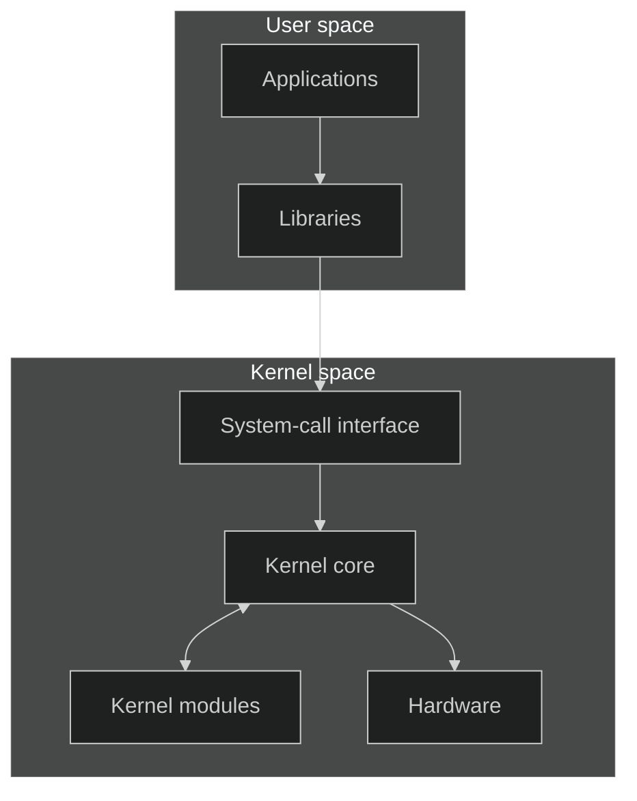
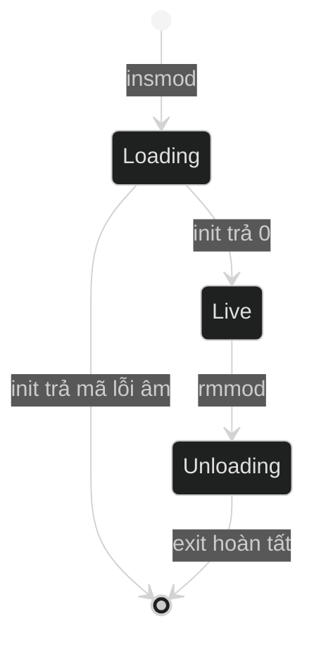

# Cơ sở lý thuyết về Loadable Kernel Module

Tài liệu này giới thiệu các khái niệm nền tảng về loadable kernel module theo
thứ tự từ mô hình thực thi, cấu trúc source, quá trình build đến quản lý tài
nguyên và chẩn đoán lỗi.

## Mục lục

1. [Kernel space và user space](#1-kernel-space-và-user-space)
2. [External loadable kernel module](#2-external-loadable-kernel-module)
3. [Cấu trúc và vòng đời module](#3-cấu-trúc-và-vòng-đời-module)
4. [Build module bằng Kbuild](#4-build-module-bằng-kbuild)
5. [Giao tiếp qua character device](#5-giao-tiếp-qua-character-device)
6. [Truyền dữ liệu và ioctl](#6-truyền-dữ-liệu-và-ioctl)
7. [Đồng bộ và quản lý tài nguyên](#7-đồng-bộ-và-quản-lý-tài-nguyên)
8. [Tương thích và chẩn đoán lỗi](#8-tương-thích-và-chẩn-đoán-lỗi)

## 1. Kernel space và user space

Kernel là phần lõi của hệ điều hành. Nó quản lý CPU, memory, process, filesystem
và thiết bị, đồng thời cung cấp system call cho chương trình.

- **Kernel space** là vùng thực thi có đặc quyền cao dành cho kernel.
- **User space** là vùng chạy ứng dụng với quyền truy cập bị giới hạn.



Kernel module mở rộng chức năng của kernel, thường được dùng cho driver,
filesystem hoặc network protocol. Module không chạy như một process độc lập và
không có hàm `main()`.

Code module chạy trong kernel space. Lỗi truy cập memory, deadlock hoặc cleanup
sai có thể ảnh hưởng đến toàn bộ hệ thống.

## 2. External loadable kernel module

Hai thuật ngữ sau mô tả hai đặc điểm khác nhau:

| Thuật ngữ | Ý nghĩa |
| --- | --- |
| External module | Source nằm ngoài Linux kernel source tree |
| Loadable module | Được build thành file `.ko` và nạp khi kernel đang chạy |
| Kbuild | Hệ thống build chính thức của Linux kernel |
| Kernel headers | Khai báo và thông tin build của một kernel |

Một external module thường được build thành loadable module. Tuy nhiên,
“external” mô tả vị trí source và cách build, còn “loadable” mô tả cách code
được đưa vào kernel.

File `.ko` trên filesystem và module đang hoạt động trong kernel là hai đối
tượng khác nhau:

- Xóa file `.ko` không gỡ module đang chạy.
- Gỡ module không xóa file `.ko`.
- Module chỉ hoạt động sau khi hàm khởi tạo hoàn tất thành công.

## 3. Cấu trúc và vòng đời module

Module đăng ký một hàm khởi tạo và một hàm kết thúc:

```c
#include <linux/init.h>
#include <linux/module.h>

static int __init example_init(void)
{
    pr_info("example: loaded\n");
    return 0;
}

static void __exit example_exit(void)
{
    pr_info("example: unloaded\n");
}

module_init(example_init);
module_exit(example_exit);

MODULE_LICENSE("GPL");
```

| Thành phần | Vai trò |
| --- | --- |
| `__init` | Đánh dấu code chỉ cần trong giai đoạn khởi tạo |
| `__exit` | Đánh dấu code chỉ cần khi gỡ module |
| `module_init()` | Đăng ký hàm khởi tạo |
| `module_exit()` | Đăng ký hàm kết thúc |
| `MODULE_LICENSE()` | Khai báo license của module |

Hàm `init` trả về `0` khi thành công hoặc một mã lỗi âm, chẳng hạn
`-ENOMEM` hay `-EINVAL`, khi thất bại. Hàm `exit` không trả về giá trị.



Metadata mô tả module và được lưu trong file `.ko`:

```c
MODULE_LICENSE("GPL");
MODULE_AUTHOR("Example Author");
MODULE_DESCRIPTION("Example kernel module");
MODULE_VERSION("1.0");
```

Có thể xem metadata bằng lệnh `modinfo`.

## 4. Build module bằng Kbuild

External module phải được build bằng Kbuild và kernel headers phù hợp với kernel
đích. Với source `example.c`, file Kbuild tối thiểu là:

```make
obj-m += example.o
```

Lệnh build:

```bash
make -C /lib/modules/$(uname -r)/build M=$PWD modules
```

| Thành phần | Ý nghĩa |
| --- | --- |
| `-C` | Chuyển sang cây build của kernel |
| `M=$PWD` | Chỉ thư mục chứa external module |
| `modules` | Yêu cầu Kbuild tạo loadable module |

Một số artifact do Kbuild tạo:

| Artifact | Mục đích |
| --- | --- |
| `*.o` | Object trung gian |
| `*.mod.c` | Metadata module được sinh tự động |
| `Module.symvers` | Thông tin symbol và version |
| `modules.order` | Thứ tự module được build |
| `*.ko` | Loadable kernel module hoàn chỉnh |

## 5. Giao tiếp qua character device

Character device truyền dữ liệu theo luồng byte. Chương trình user space thường
truy cập driver thông qua một device node trong `/dev`.


Major number xác định driver; minor number phân biệt các device do cùng driver
quản lý. Device node chỉ chứa thông tin giúp VFS tìm đúng driver, không chứa dữ
liệu nội bộ của driver.

Quá trình đăng ký character device thường gồm:

1. Cấp major/minor bằng `alloc_chrdev_region()`.
2. Khởi tạo `struct cdev` bằng `cdev_init()`.
3. Đăng ký `cdev` bằng `cdev_add()`.
4. Tạo device class bằng `class_create()`.
5. Thêm device vào Linux device model bằng `device_create()`.

`struct file_operations` ánh xạ system call tới callback:

```c
static const struct file_operations example_fops = {
    .owner = THIS_MODULE,
    .open = example_open,
    .read = example_read,
    .write = example_write,
    .release = example_release,
    .unlocked_ioctl = example_ioctl,
};
```

`.owner = THIS_MODULE` giúp kernel giữ reference tới module khi file đang được
mở, tránh gỡ module trong lúc callback vẫn có thể được gọi.

## 6. Truyền dữ liệu và ioctl

Kernel không được dereference trực tiếp pointer do user space cung cấp. Các API
thường dùng gồm:

- `copy_from_user()`: sao chép dữ liệu từ user space vào kernel.
- `copy_to_user()`: sao chép dữ liệu từ kernel về user space.
- `simple_read_from_buffer()`: đọc từ kernel buffer và cập nhật file offset.
- `simple_write_to_buffer()`: ghi vào kernel buffer và cập nhật file offset.

Các hàm copy có thể không sao chép hết dữ liệu. Driver phải kiểm tra giá trị trả
về và trả mã lỗi phù hợp, thường là `-EFAULT`, khi thao tác thất bại.

File offset cho biết vị trí đọc hoặc ghi hiện tại. Khi không còn dữ liệu để đọc,
callback `read` trả về `0` để báo EOF.

`ioctl()` được dùng cho thao tác điều khiển không phù hợp với `read()` hoặc
`write()`. Command number thường được tạo bằng các macro:

| Macro | Hướng dữ liệu |
| --- | --- |
| `_IO` | Không có payload |
| `_IOR` | Kernel trả dữ liệu về user space |
| `_IOW` | User space gửi dữ liệu vào kernel |
| `_IOWR` | Dữ liệu đi theo cả hai chiều |

Kernel module và chương trình user space phải dùng cùng command number và kiểu
payload. Một header dùng chung giúp hai phía giữ giao diện nhất quán.

## 7. Đồng bộ và quản lý tài nguyên

Khi nhiều process truy cập cùng trạng thái, driver phải có cơ chế đồng bộ.
Mutex phù hợp với critical section có thể sleep:

```c
if (mutex_lock_interruptible(&buffer_lock))
    return -ERESTARTSYS;

/* Đọc hoặc thay đổi trạng thái dùng chung. */

mutex_unlock(&buffer_lock);
```

`mutex_lock_interruptible()` cho phép quá trình chờ lock bị ngắt bởi signal.
Mọi nhánh sau khi đã lấy lock phải mở lock trước khi trả về.

Nếu hàm `init` tạo nhiều tài nguyên, mỗi nhánh lỗi phải thu hồi những tài
nguyên đã tạo theo thứ tự ngược:

```text
Khởi tạo: A → B → C
Cleanup:  C → B → A
```

Kernel API thường báo lỗi theo ba dạng:

- Mã lỗi âm như `-ENOMEM` hoặc `-EINVAL`.
- `NULL`.
- Error pointer, kiểm tra bằng `IS_ERR()` và lấy mã lỗi bằng `PTR_ERR()`.

Nguyên tắc quản lý tài nguyên:

1. Kiểm tra kết quả của API có thể thất bại.
2. Không cleanup tài nguyên chưa được tạo.
3. Cleanup theo thứ tự ngược với khởi tạo.
4. Không để callback sử dụng tài nguyên sau khi giải phóng.
5. Hàm `exit` phải thu hồi toàn bộ tài nguyên module đang sở hữu.

## 8. Tương thích và chẩn đoán lỗi

Linux không cam kết ABI nội bộ ổn định cho external module. File `.ko` được
build cho kernel này có thể không nạp được trên kernel khác.

Các lệnh kiểm tra cơ bản:

```bash
uname -r
modinfo example.ko
modinfo -F vermagic example.ko
lsmod
sudo dmesg | tail
```

| Hiện tượng | Nguyên nhân thường gặp |
| --- | --- |
| `Invalid module format` | Module không khớp phiên bản hoặc cấu hình kernel |
| `Unknown symbol` | Thiếu dependency hoặc symbol không được export |
| `Key was rejected` | Secure Boot từ chối module chưa ký |
| `Module is in use` | Module vẫn còn reference đang hoạt động |
| Không có device node | Driver chưa đăng ký thành công hoặc udev chưa xử lý |
| `Permission denied` | User không có quyền trên device node |

Kernel log là nguồn thông tin đầu tiên khi module không load hoặc hoạt động
không đúng. Không nên ép kernel nạp một module không tương thích; hãy build lại
bằng headers và configuration đúng của kernel đích.

## Tóm tắt

Luồng làm việc cơ bản với một loadable kernel module:

```text
Viết source
    → khai báo quy tắc Kbuild
    → build thành file .ko
    → kiểm tra metadata và vermagic
    → nạp module
    → quan sát kernel log
    → sử dụng chức năng
    → gỡ module và xác nhận cleanup
```
